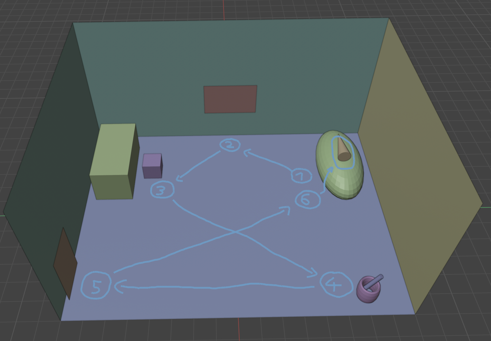
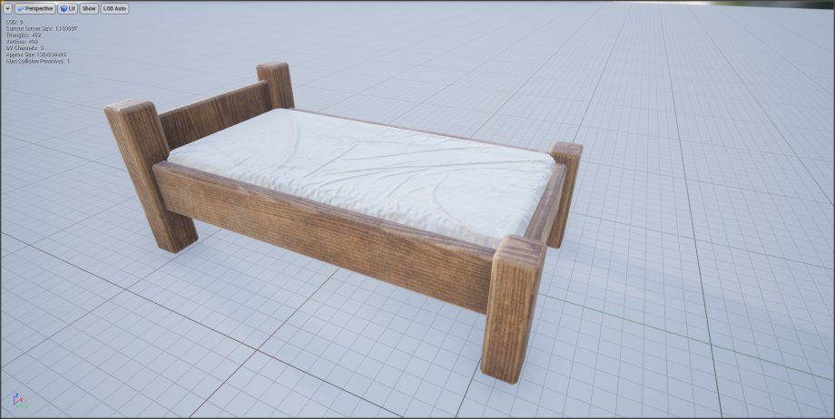
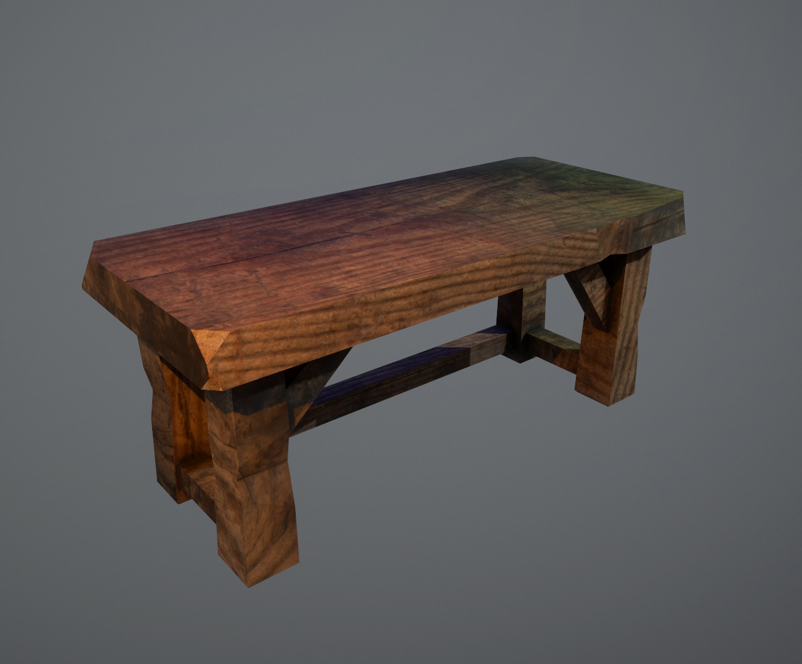
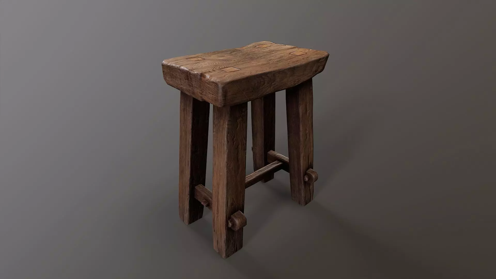
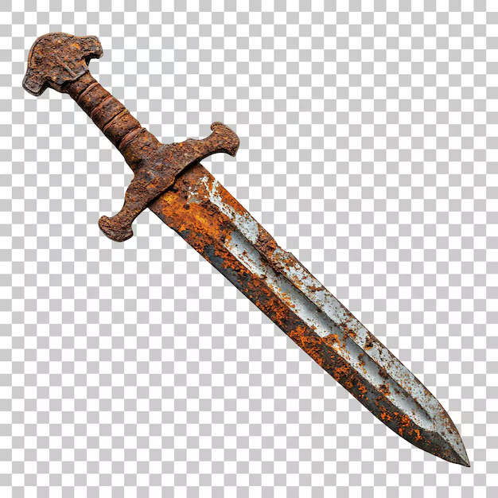
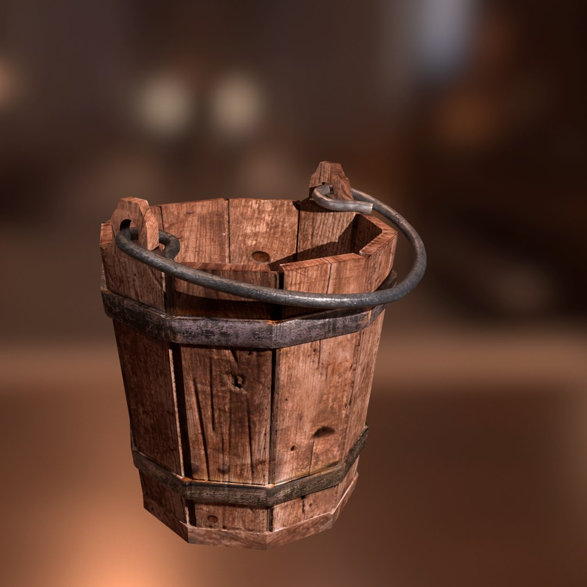
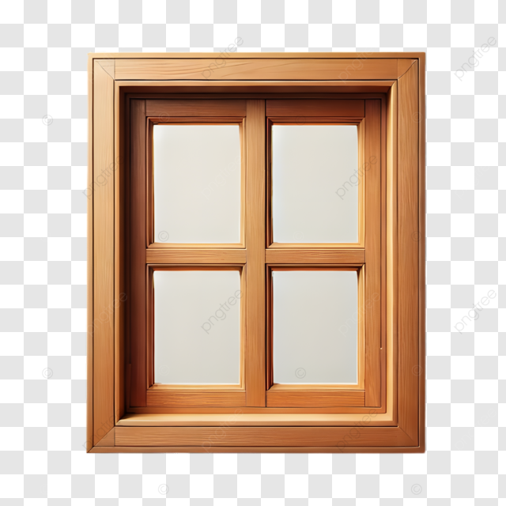
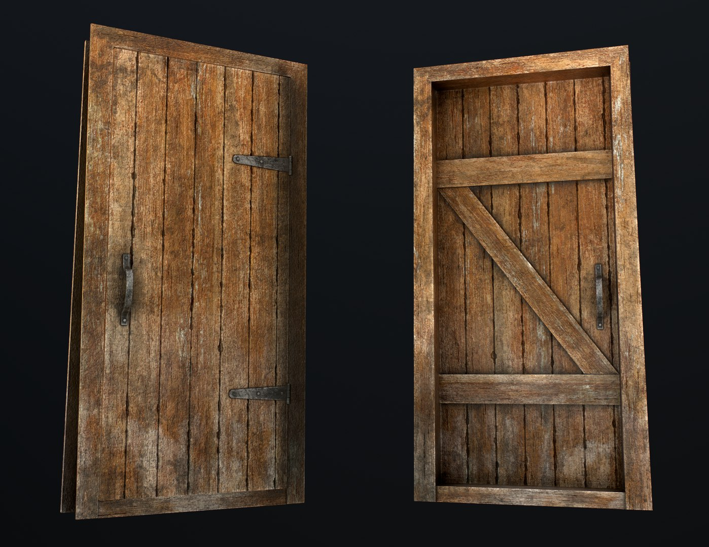

# Room Scene Blockout - Dokumentation

## 1. Übersicht
Kurze Übersicht zum Zweck des Blockouts und dem Kontext im Spiel.

- **Raummaße:** 16m x 12m (Rechteck)
- **Zweck:** 
  - Startraum des Protagonisten
  - Tutorial-Bereich
  - Interaktion mit den Assets/Objekten steht im Vordergrund
  - Charakterpersönlichkeiten des Protagonisten zeigen durch seine Gedanken beim interagieren mit den Assets/Objekten
- **Hinweis**: Die Game-User-Story die hier beschrieben ist, muss nicht im Spiel so umgesetzt werden um vorran zu kommen, sie **SOLL** aber umgesetzt werden können, der Spieler **SOLL** die Möglichkeit haben mit seinem Umfeld interagieren zu können wenn er das will. Die Game-User-Story zeigt die "Vielfalt" an Interaktionsmöglichkeiten im Zimmer. Der Spieler darf/kann auch alles ignorieren und direkt zur Tür laufen und das Zimmer verlassen.

---

## 1.1 Interaktionssystem

### Steuerung
- **Interaktionstaste:** `E`
- **Mindestdistanz:** Der Spieler muss sich in einem Radius von **< 0.5 Metern** zum Objekt befinden

### Interaktions-Feedback
Wenn der Spieler nah genug an einem interagierbaren Objekt ist: 
- Ein visueller Hinweis erscheint über/auf dem Objekt (z. B. `[E]`)
- Das Objekt wird leicht hervorgehoben (z. B. Outline-Effekt)

### Interagierbare Objekte im Zimmer
| Objekt | Interaktion möglich | Ergebnis |
|--------|---------------------|----------|
| Bett | ✅ | Dialog + Schlaf-Option |
| Fenster | ✅ | Dialog (Aussicht) |
| Schreibtisch | ✅ | Dialog |
| Schwert/Behälter | ✅ | Dialog |
| Tür | ✅ | Dialog + Rausgehen-Option |
| Wände/Boden | ❌ | Keine Interaktion |

---

## 2. Initiales Blockout - Asset-Übersicht

### Blockout Übersicht über das ganze Zimmer


### Blockout Übersicht mit Annotationen der Assets


### Asset-Legende:
| Asset | Position im Raum |
|-------|------------------|
| Bett | Rechts oben im Zimmer |
| Schreibtisch + Stuhl | Links oben im Zimmer |
| Schwert mit Behälter | Rechts unten im Zimmer |
| Fenster | Mittig an der Wand |
| Tür | Links unten im Zimmer |

---

## 3. Game-User-Story Ablauf

### Schritt 1: Aufwachen im Bett

> Der Spieler wacht in seinem Bett auf und steht auf. Er redet zu sich selber nach dem Aufstehen. 

Beim aufstehen erscheint eine Dialog Box mit folgendem Dialog drin:
```text
"..."
"Schon Mittag."
"Mein Körper ist wach. Mein Kopf noch nicht."
"..."
"Ich wollte gestern nur ein Kapitel lesen."
"Es wurden… mehr."
```

### Schritt 2: Interaktion mit Fenster

> Der Spieler läuft zum Fenster und interagiert damit. Eine Textbox beschreibt die Aussicht auf das Dorf.

Beim interagieren spricht der Protagonist zu sich selbst. Folgende Dialog Box erscheint:

```text
*Du schaust hinaus auf die Hauptstraße*
"Händler. Viele davon."
"..."
"Werd ich eines Tages dieses Dorf verlassen können..."
```

### Schritt 3: Interaktion mit Schreibtisch

> Der Spieler läuft zum Schreibtisch und interagiert damit. Er beschreibt wie schlimm der Tisch aussieht und das er zu gestern zu lange gelesen hat.

Beim interagieren beschreibt der Protagonist den Tisch. Folgende Dialog Box erscheint:

```text
*Du betrachtest deinen Schreibtisch*
"..."
"Das Buch von gestern liegt noch offen."
"Ich weiß nicht mal mehr, wann ich aufgehört habe zu lesen."
"..."
"Der Tisch sieht aus, als hätte er den Kampf schon aufgegeben."
"Genau wie der Stuhl."
"..."
"Aufräumen wäre gut."
```


### Schritt 4: Schwert aufnehmen

> Der Spieler geht zum Behälter und interagiert mit dem rostigen Schwert.

Beim interagieren beschreibt der Protagonist das Schwert. Folgende Dialog Box erscheint:

```text
*Du blickst auf das rostige Schwert*
"..."
"Das ist alles, was von ihm geblieben ist."
"..."
"Nicht gerade heldenhaft."
"Aber ehrlich."
"..."
"Vielleicht lässt sich noch etwas retten."
"Vom Schwert."
"..."
"Und vielleicht auch von mir."
```

### Schritt 5: Tür-Interaktion

> Der Spieler läuft zur Tür und interagiert, verlässt aber das Zimmer nicht.

Beim interagieren mit der Tür entscheidet der Protagonist ob er raus gehen will oder nicht. Folgende Dialog Box erscheint:

```text
*Willst du rausgehen?*
> Ja
> Nein

> Nein:
"Draußen ist es laut."
"Hier drin ist es ruhig."
"..."
"Zu ruhig."

> Ja:
*Kein Dialog, du verlässt das Zimmer*
```

### Schritt 6: Zurück zum Bett

> Der Spieler läuft zurück zum Bett, und interagiert damit.

Beim interagieren mit dem Bett entscheidet der Protagonist ob er schlafen gehen will oder nicht. Folgende Dialog Box erscheint:

```text
*Willst du schlafen gehen?*
> Ja
> Nein

> Ja:
"Noch ein bisschen."
"Nur kurz."
"..."
"*Du schließt die Augen*"

> Nein:
"Wenn ich jetzt wieder schlafe, wird morgen genauso."
"..."
"Und genau das will ich eigentlich nicht."
```

### Schritt 7: Im Bett schlafen

> Der Spieler wählt die Option sich wieder schlafen zu legen, ein neuer Tag beginnt

```text
*Die Welt verblasst*
"..."
"Vielleicht wird morgen anders."
```

### Komplette Game User Story abgebildet mit zufälligen Farben der Assets


---

## 4.  Asset-Referenzen

### 4.1 Bett

**Source**: https://free3d.com/de/3d-model/single-bed-game-asset-free-928701.html

- **Material:** Holzrahmen
- **Stil:** Einzelbett
- **Maße:**
  - Länge: 3.0m
  - Breite: 1.5m

---

### 4.2 Schreibtisch & Stuhl

### Tisch

**Source:**  https://www.artstation.com/marketplace/p/e0qK/low-poly-wooden-table
- **Material:** Holz
- **Stil:** Simpel, funktional, abgenutzt
- **Maße**
  - Länge: 2.5m
  - Breite: 1.5m
  - Höhe: 1.0m

### Stuhl

**Source:** https://www.cgtrader.com/3d-models/interior/living-room/medieval-stool-2fcf9302-4f57-4053-a48a-e32cca5bd830

- **Material:** Holz
- **Stil:** Simpel, funktional, abgenutzt
- **Maße:**
  - Länge: 0.5m
  - Breite 0.5m
  - Sitzhöhe 0.7m

---

### 4.3 Schwert

**Source:** https://www.freepik.com/premium-psd/vintage-rusty-sword-featuring-corroded-blade-simple-crossguard-isolated_408318588.htm

- **Zustand:** Rostig, abgenutzt
- **Aussehen:** Sieht aus als könnte es jeden Moment zerbrechen
- **Maße:**
  - Gesamtlänge: 1.0m
  - Klingenlänge: 0.7m
  - Grifflänge: 0.3m

---

### 4.4 Behälter/Eimer

**Source:** https://www.turbosquid.com/3d-models/medieval-bucket-games-fbx/1073665

- **Material:** Holz/Metall
- **Funktion:** Hält das Schwert des Protagonisten
- **Maße:**
  - Höhe: 0.4m
  - Durchmesser (oben): 0.35m
  - Durchmesser (unten): 0.25m

---

### 4.5 Fenster

**Source:** https://pngtree.com/freepng/a-wooden-window-frame-with-four-square-panes_20594161.html

- **Form:** Quadratisch, 4 gleichmäßige Unterteilungen
- **Position:** Mittig an der Wand
- **Funktion:** Atmosphäre, Tageszeit-Beleuchtung
- **Maße:**
  - Breite: 1.0m
  - Höhe: 1.0m
  - Höhe über Boden: 1.2m

---

### 4.6 Tür

**Source:** https://www.turbosquid.com/3d-models/old-door-3d-model-1616479

- **Material:** Holz (Hauptkörper), Metall (Türgriff, Schlüsselloch)
- **Funktion:** Zimmer verlassen
- **Maße:**
  - Breite: 0.8m
  - Höhe: 2.0m
  - Dicke: 0.05m
  - Türknauf-Höhe: 1.0m

---

### 4.7 Boden & Wände

**Source:** https://www.textures.com/browse/old-planks/114537

- **Material:** Holzplanken
- **Maße Boden:**
  - Breite:  16m
  - Länge: 12m
- **Maße Wände:**
  - Höhe: 5.0m

---

### Hinweise zu den Assets

#### Referenzbilder:
Zu allen Referenzbildern gibt es einen Link zu der Website aus dem ich das Bild runtergeladen habe. Die Assets *müssen nicht* genauso aussehen. Sie dienen als Orientierung zur Modellierung/Texturierung der Assets.

#### Maße:
Die Maße die angegeben sind entsprechend nicht bei allen dem was im `Room_Blockout.blend` Blockout ist. In den Asset-Referenzen sind die Maßen angegeben die das Asset **haben** soll. Die Maße müssen ebenfalls nicht zu 100% einstimmen mit dem was bei [Assets-Referenzen](#4--asset-referenzen) angegeben ist, es dient ebenfalls als Orienterung.

---

## 5. Asset-Priorisierung

| Priorität | Asset | Begründung |
|-----------|-------|------------|
| 1 | Bett | Startpunkt der User-Story |
| 2 | Schwert | Zentrales Gameplay-Element |
| 3 | Tür | Story-Progression |
| 4 | Tisch + Stuhl | Interaktionspunkt |
| 5 | Fenster | Atmosphäre/Worldbuilding |
| 6 | Behälter/Eimer | Hält das Schwert |