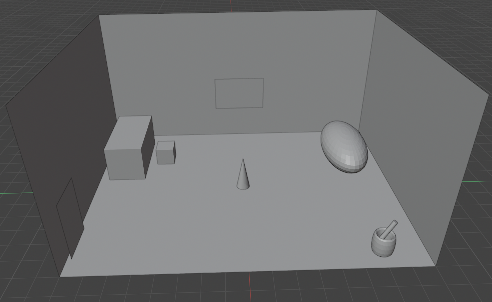
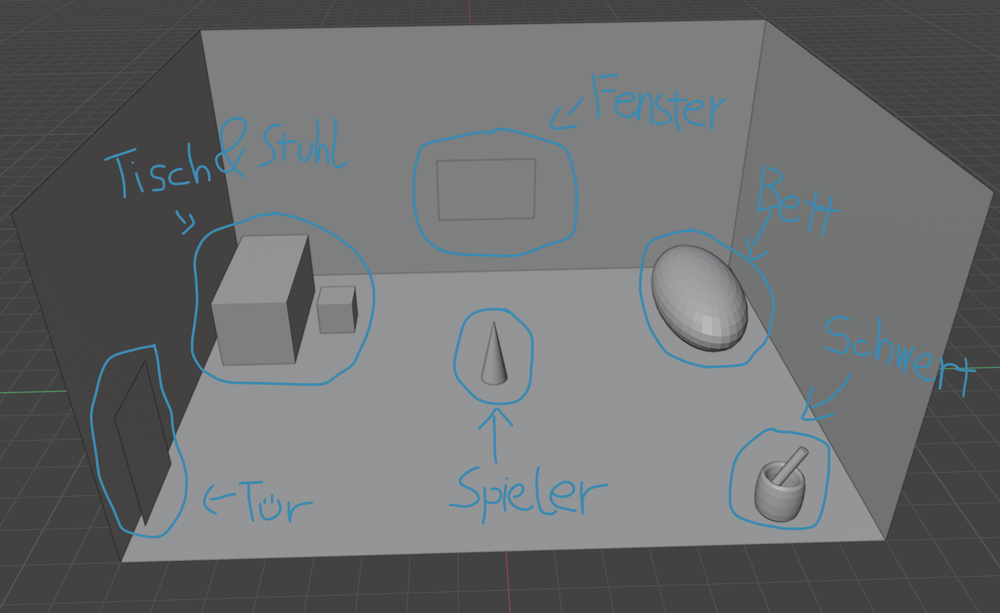
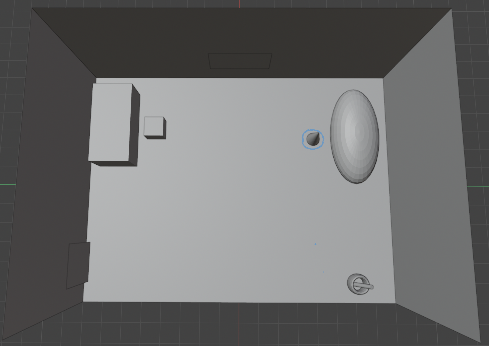
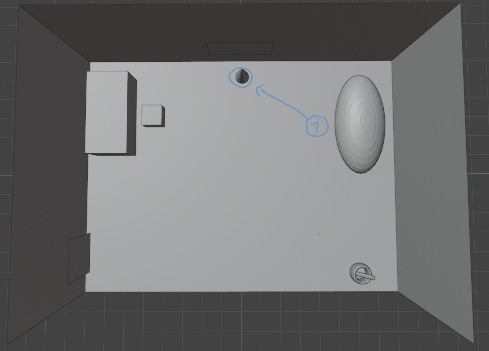
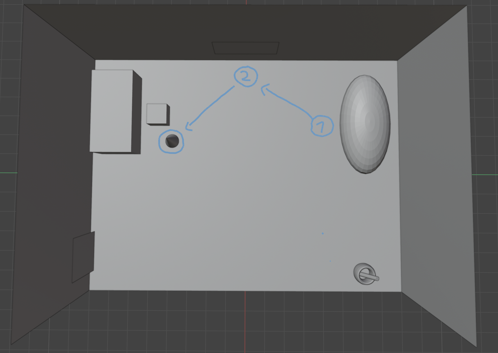
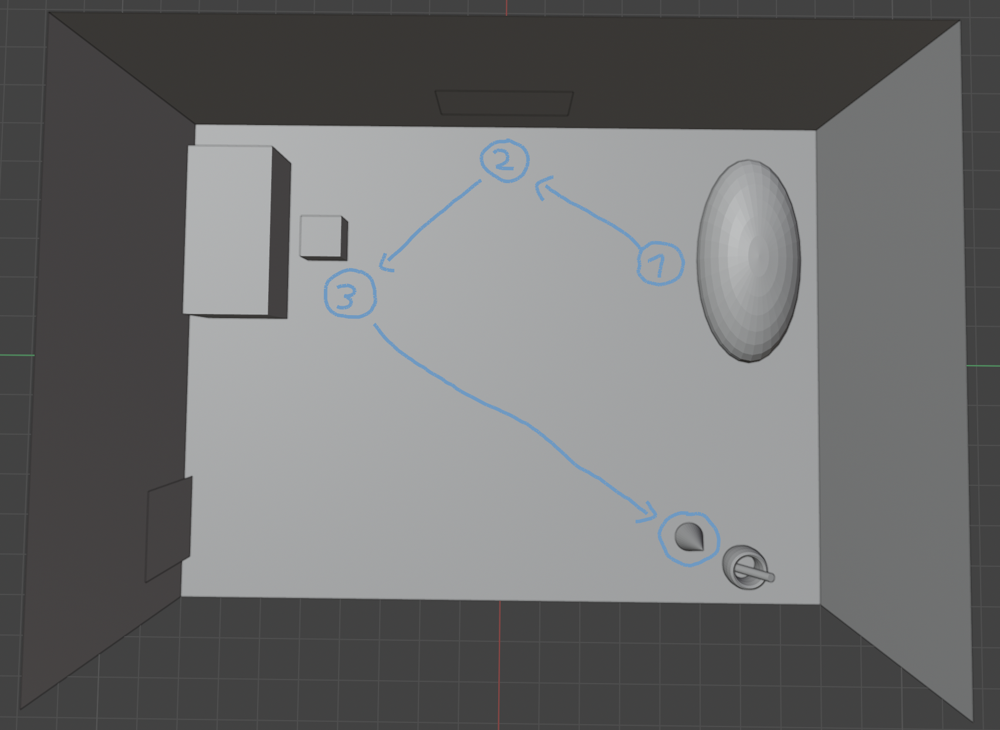
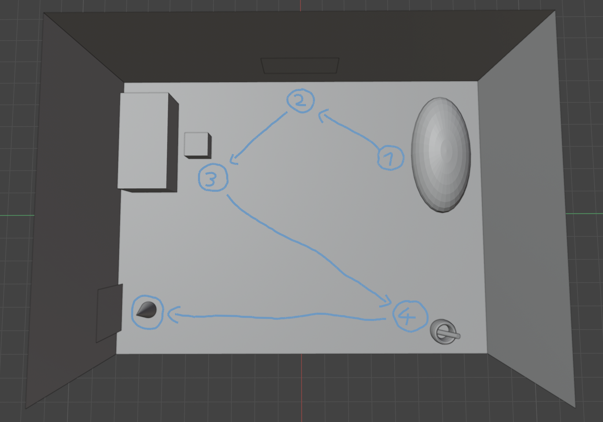
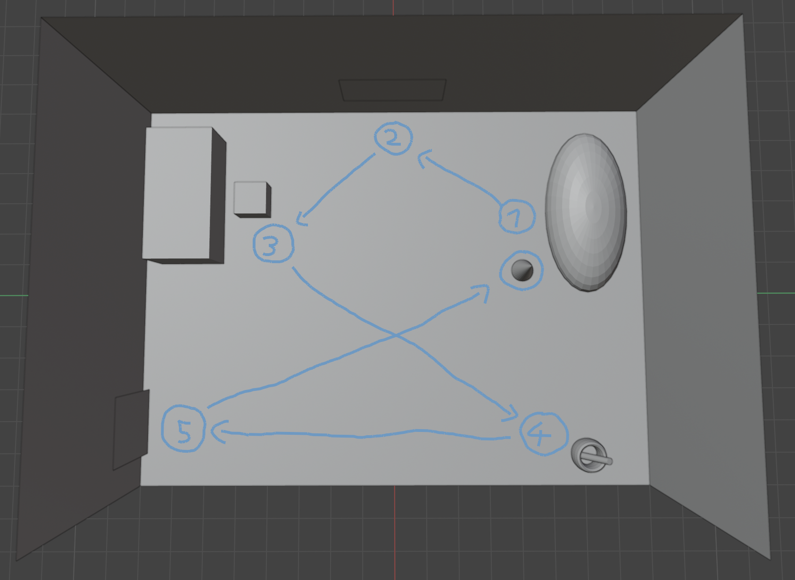
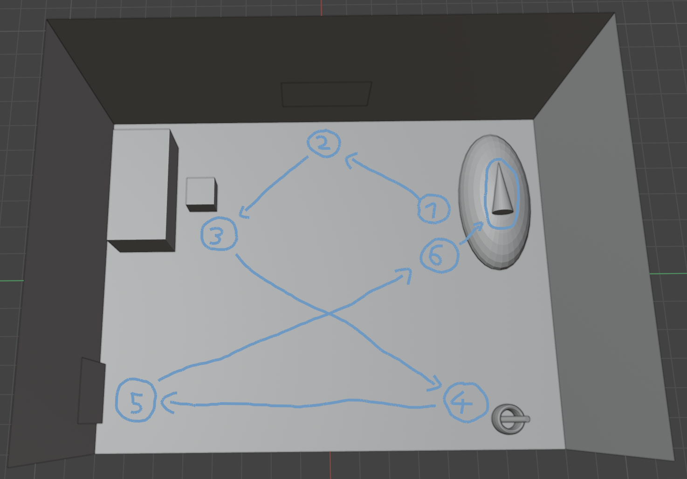

# Room Scene Blockout - Dokumentation

## 1. Übersicht
Kurze Übersicht zum Zweck des Blockouts und dem Kontext im Spiel.

- **Raummaße:** 16m x 12m (Rechteck)
- **Zweck:** Startraum des Protagonisten, Tutorial-Bereich

---

## 2. Initiales Blockout - Asset-Übersicht

### Blockout Übersicht über das ganze Zimmer

### Blockout Übersicht mit Annotationen der Assets

### Asset-Legende:
| Block | Asset | Position im Raum |
|-------|-------|------------------|
| A | Bett | Rechts oben im Zimmer |
| B | Schreibtisch + Stuhl | Links oben im Zimmer |
| C | Schwert mit Behälter | Rechts unten im Zimmer |
| D | Fenster | Mittig an der Wand |
| E | Tür | Links unten im Zimmer |

---

## 3. Game-User-Story Ablauf

### Schritt 1: Aufwachen im Bett

> Der Spieler wacht in seinem Bett auf und steht auf. 

### Schritt 2: Interaktion mit Fenster

> Der Spieler läuft zum Fenster und interagiert damit.  Eine Textbox beschreibt die Aussicht auf das Dorf. 

### Schritt 3: Interaktion mit Schreibtisch

> Der Spieler läuft zum Schreibtisch und interagiert damit. 

### Schritt 4: Schwert aufnehmen

> Der Spieler geht zum Behälter und interagiert mit dem rostigen Schwert. 

### Schritt 5: Tür-Interaktion

> Der Spieler läuft zur Tür und interagiert, verlässt aber das Zimmer nicht. 

### Schritt 6: Zurück zum Bett

> Der Spieler läuft zurück zum Bett, und interagiert damit.

### Schritt 7: Im Bett schlafen

> Der Spieler wählt die Option sich wieder schlafen zu legen, ein neuer Tag beginnt

---

## 4. Asset-Referenzen

### 4.1 Bett

- **Material:** Holzrahmen
- **Stil:** Einzelbett, rustikal/mittelalterlich

### 4.2 Schreibtisch & Stuhl

- **Material:** Holz
- **Stil:** Simpel, funktional

### 4.3 Schwert

- **Zustand:** Rostig, abgenutzt
- **Aussehen:** Sieht aus als könnte es jeden Moment zerbrechen

### 4.4 Behälter/Eimer

- **Material:** Kupferähnlich
- **Funktion:** Hält das Schwert des Protagonisten

### 4.5 Fenster

- **Form:** Quadratisch, 4 gleichmäßige Unterteilungen
- **Position:** Mittig an der Wand

### 4.6 Tür

- **Material:** Holz (Hauptkörper), Metall (Türknauf, Schlüsselloch)

### 4.7 Boden & Wände

- **Material:** Holzplanken

---

## 5. Asset-Priorisierung

| Priorität | Asset | Begründung |
|-----------|-------|------------|
| 1 | Bett | Startpunkt der User-Story |
| 2 | Schwert | Zentrales Gameplay-Element |
| 3 | Behälter/Eimer | Hält das Schwert |
| 4 | Tisch + Stuhl | Interaktionspunkt |
| 5 | Tür | Story-Progression |
| 6 | Fenster | Atmosphäre/Worldbuilding |

---

## 6. Notizen / Nächste Schritte
- [ ] Dialoge für die Interaktion mit Assets schreiben
- [ ] Asset Referenzen raussuchen
- [ ] Material aussuchen und mit Gimp in die Blöcke "klonen"
- [ ] Als .fbx exportieren und in GitHub bereitstellen