# Village Scene Blockout – Dokumentation

## 1. Übersicht
Kurze Übersicht zum Zweck des Dorf-Blockouts und dem Kontext im Spiel.

- **Szenentyp:** Dorf (Außenareal)
- **Zweck:**  
  - Zentrale Hub-Area des Spiels  
  - Verbindung zwischen Story, Quests und Gameplay-Systemen  
  - Einführung wichtiger NPCs  
  - Trainings-, Handels- und Sozialraum
- **Hinweis:**  
  Das Dorf dient als lebendige Spielwelt. Die hier beschriebene Game-User-Story **SOLL** spielbar sein, ist aber **nicht zwingend erforderlich**, um das Spiel voranzubringen. Der Spieler kann das Dorf frei erkunden, Aktivitäten ignorieren oder gezielt nutzen.

---

## 2. Interaktions- & Navigationssystem

### Steuerung
- **Bewegung:** WASD (Standard)
- **Interaktionstaste:** `E`
- **Mindestdistanz:** < 0.75m (größer als bei Innenräume)

### Interaktions-Feedback
- Visueller Hinweis `[E]` bei Objekten/NPCs  
- Leichte Hervorhebung (Outline / Light Tint)  
- Dialogfenster bei NPC interaktion oder direkte Aktion

---

## 3. Tageszyklus & Atmosphäre

### Tagesphasen
- **Morgen:**
  - Warmes Licht
  - Vogelgeräusche

- **Mittag:**  
  - Klares Licht  
  - Dorfalltag hörbar  

- **Abend:**  
  - Mondlicht  
  - Fackeln  
  - Eulen  

**Hinweis:**  
Der Tageszyklus wird **rein atmosphärisch** vermittelt **KEIN** HUD.

---

## 4. Wichtige NPCs im Dorf

### Gregory – Wache
- Aufenthaltsort: Kampfarena / Tore  
- Persönlichkeit: Still, diszipliniert  
- Bewundert: `Stärke`

**Interaktionsrolle:**  
- Trainings-Quest  
- Kampfrelevante Dialoge  

---

### Bertram – Ausrüstungshändler
- Aufenthaltsort: Ausrüstungsladen  
- Persönlichkeit: Gierig, aber leidenschaftlicher Schmied  
- Bewundert: `Glück`

**Interaktionsrolle:**  
- Händler
- Questgeber
- Upgrade-System

---

### Mila – Dorfbewohnerin
- Aufenthaltsort: Haus / Dorfbereich
- Persönlichkeit: Ruhig, neugierig
- Bewundert: `Intelligenz`

**Interaktionsrolle:**  
- Lore / Backgorund Informationen
- Optionale Nebenquests

---

## 5. Beziehungsstatus-System (NPCs)

### Zustände
- Gleichgültig  
- Reserviert
- Verwirrt
- Wohlgesonnen
- Ablehnend

### Zustandsdynamik


- Gleichgültig → Reserviert / Wohlgesonnen / Verwirrt
- Verwirrt → Reserviert / Wohlgesonnen / Ablehnend / Gleichgültig
- Wohlgesonnen → Verwirrt / Gleichgültig
- Reserviert → Verwirrt / Ablehnend
- Ablehnend → Reserviert / Verwirrt

---

## 6. Dorf – Struktur & Layout

### Gesamtübersicht Dorf Blockout:
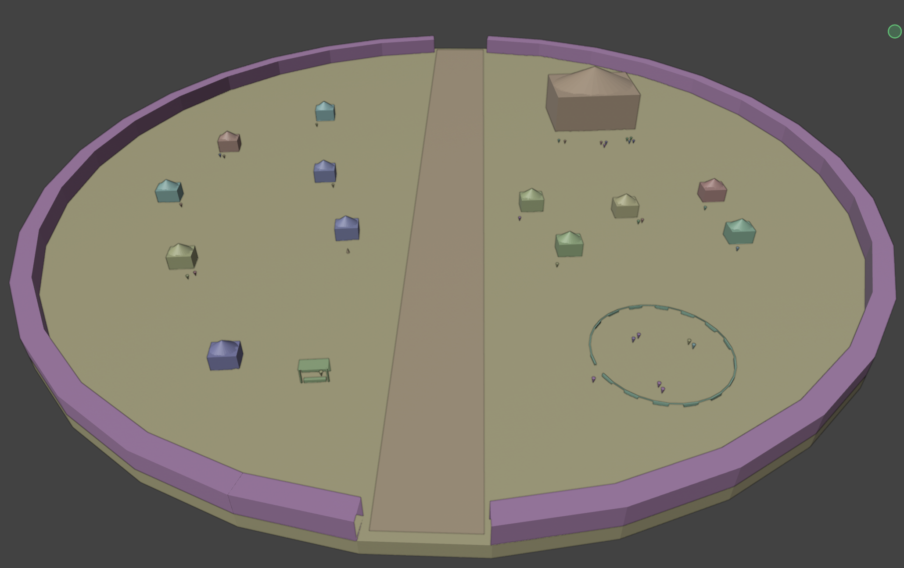

### Annotierte Übersicht (Zonen & Assets):
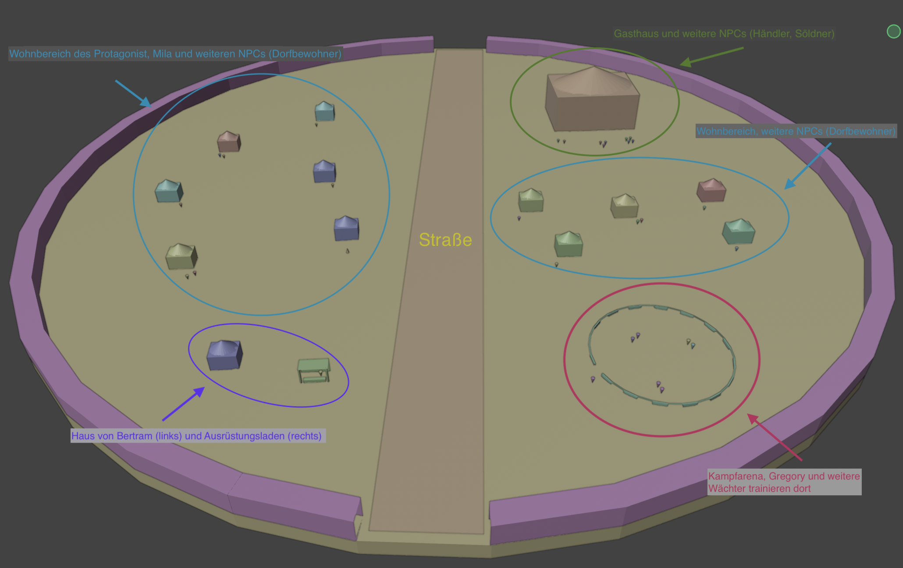

### Zonen-Übersicht:
| Zone | Beschreibung |
|------|--------------|
| Wohnbereich (West) | Häuser inklusive Haus des Protagonisten und von Mila |
| Handelsbereich (Süd-Westlich) | Ausrüstungsladen und Haus von Bertram |
| Trainingsbereich (Süd-Östlich) | Kampfarena und Aufenthaltsort von Gregory |
| Wohnbereich (Ost) | Häuser von einfachen NPCs/Dorfbewohnern |
| Gasthausbereich (Nord-Östlich) | Gasthaus und Aufenthaltsort von Händler und Söldnern |

### Infrastruktur:
| Asset | Beschreibung |
|-------|--------------|
| Straße | Läuft in der Mitte durch das Dorf hindurch, hauptsächlich von fahrenden Händlern besetzt |
| Zaun | Eine großer Zaun um das Dorf einmal drum, zur Verteidigung von Wildtieren und Monstern nachts |
| Tore (nicht im Blockout drin) | Beide Toren am beiden Enden der Straße schließen Abends zur Sicherheit des Dorfes |

---

## 7. Game-User-Story Ablauf – Dorf Quest (Bertram)

Die folgende Game-User-Story startet im **Zimmer des Protagonisten** und führt den Spieler anschließend ins Dorf.  
Sie verbindet die Room-Szene direkt mit der Dorf-Szene und nutzt das Schwert als zentrales Gameplay-Element.

### Hinweis zu Protagonist und NPCs darstellung

#### Der Protagonist ist mit einem Kegel in dem Blockout repräsentiert:
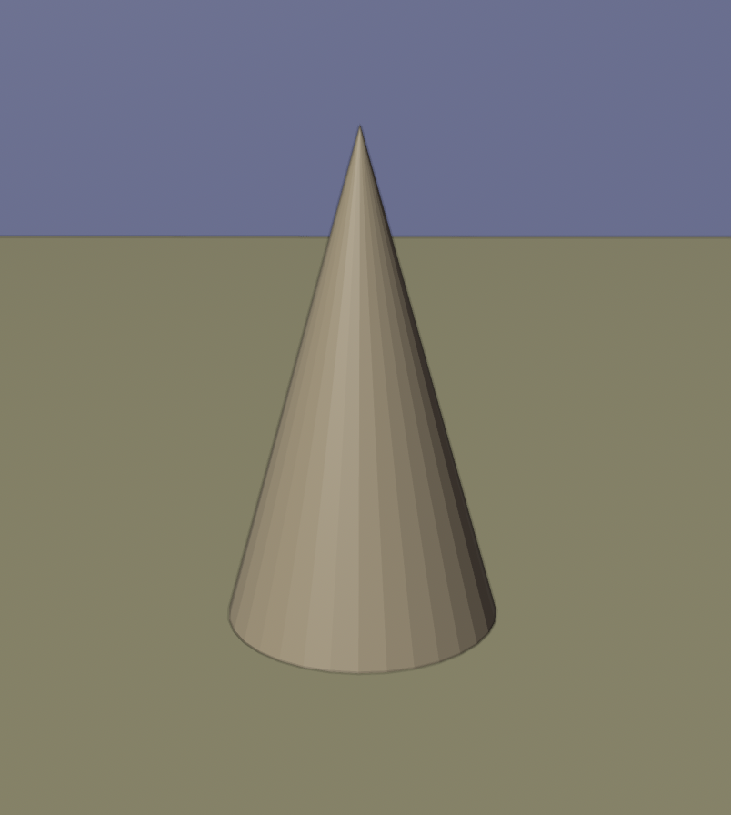

#### NPCs sind mit einem umgedrehten Kegel repräsentiert:


---

### Schritt 1: Im Zimmer aufwachen
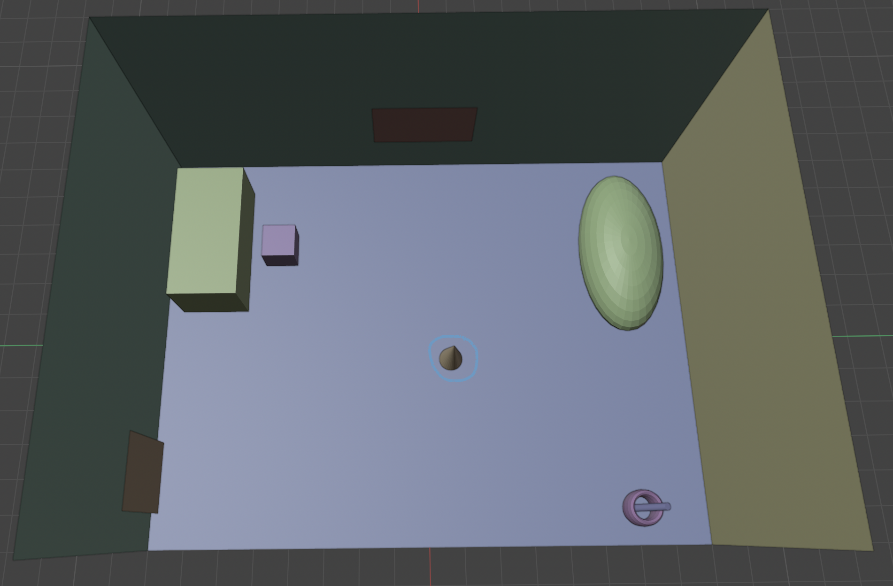

> Der Spieler befindet sich in seinem Zimmer.

**Dialog:**
```text
(Placeholder)
```

Fokus:
- Übergang von Tutorial zu freier Bewegung  
- Vertraute Umgebung aus der Room-Szene  

---

### Schritt 2: Interaktion mit dem Schwert
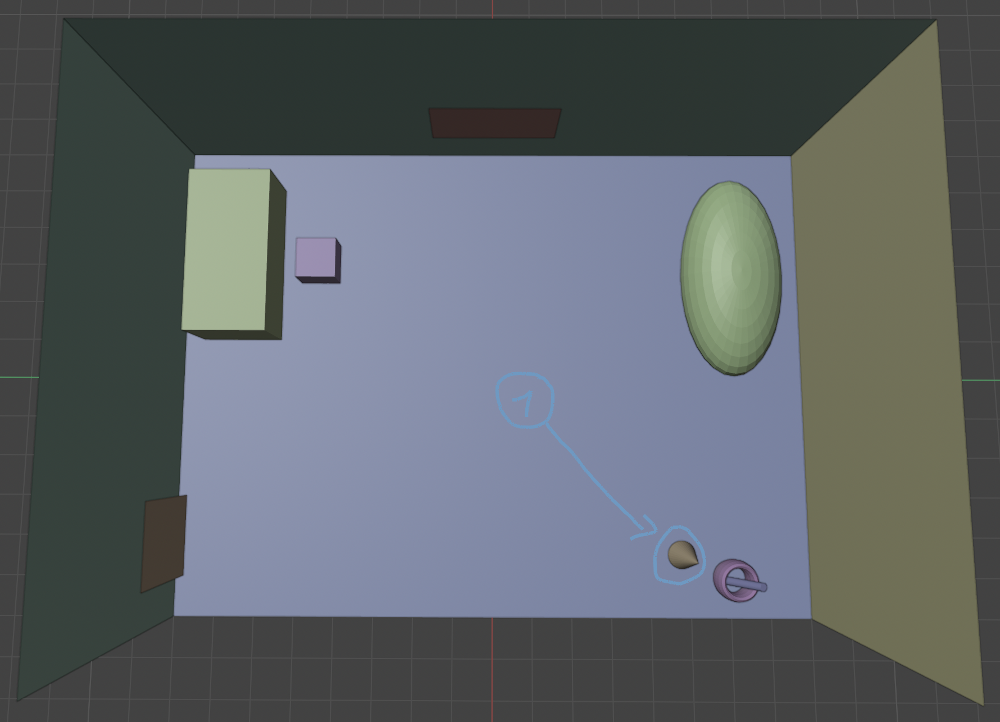

> Der Spieler interagiert mit dem rostigen Schwert im Zimmer zweimal.

**Dialog:**
```text
(Placeholder)
```

Ergebnis:
- Gedankendialog über den schlechten Zustand  
- Möglichkeit, das Schwert mitzunehmen  

---

### Schritt 3: Zimmer verlassen
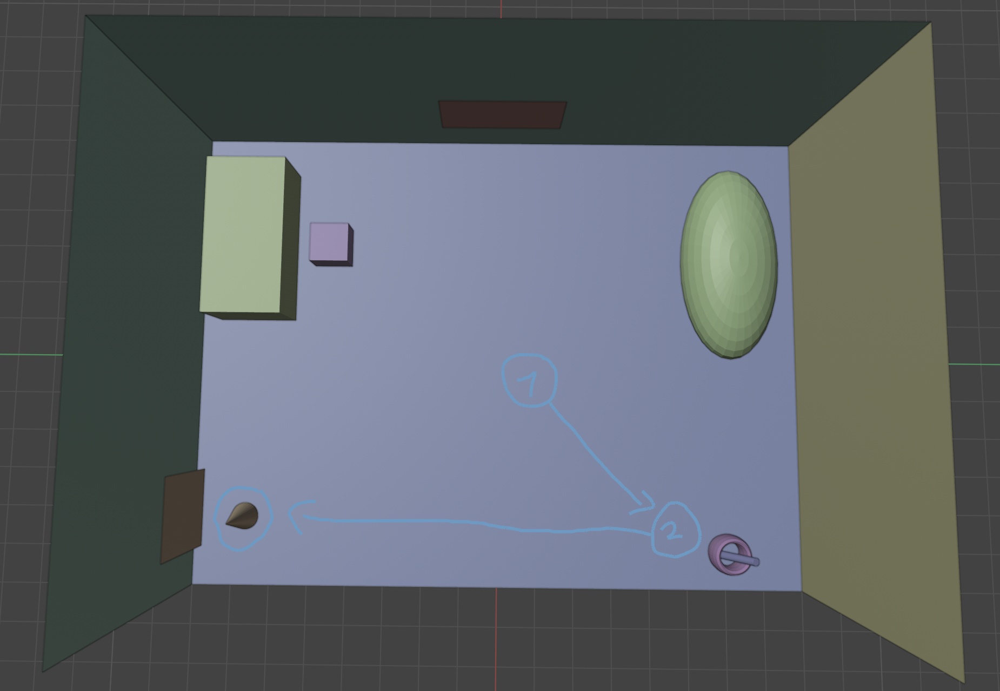

> Der Spieler verlässt das Zimmer und betritt das Dorf.

**Dialog:**
```text
(Placeholder)
``` 

---

### Schritt 4: Ankunft im Dorf

#### Nördliche Sicht:
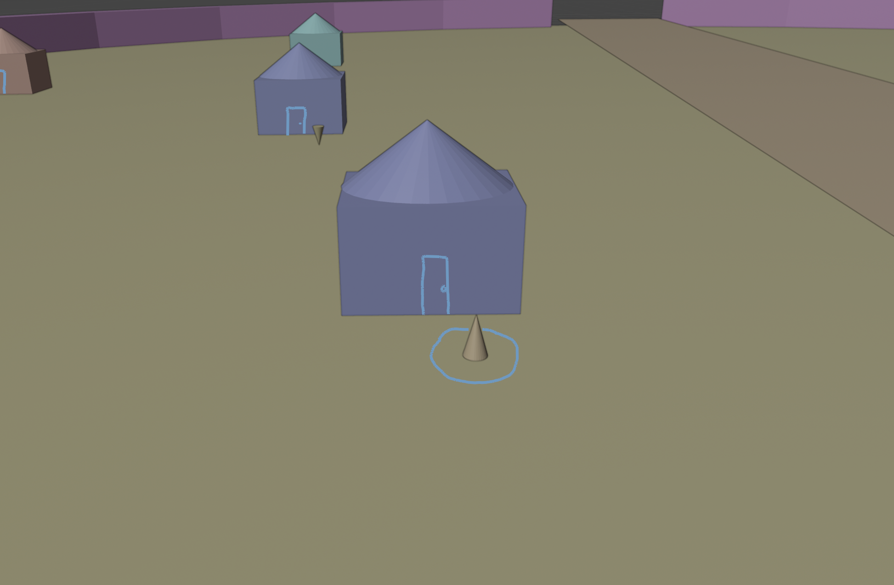

#### Östliche Sicht:
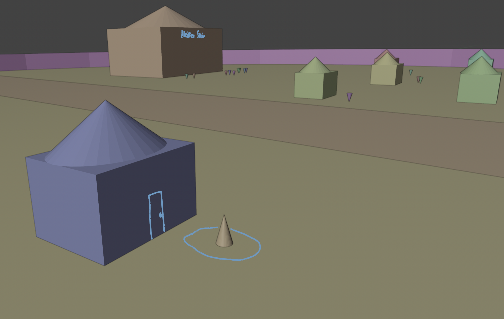

#### Südliche Sicht:
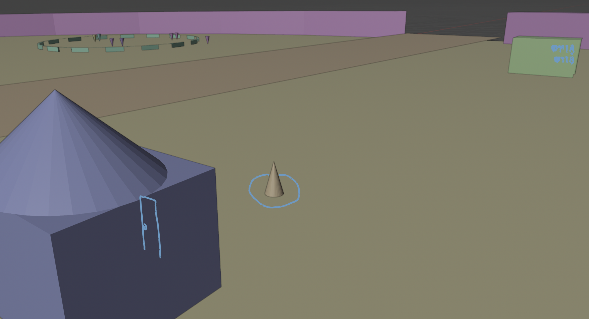

#### Vogelperspektive:
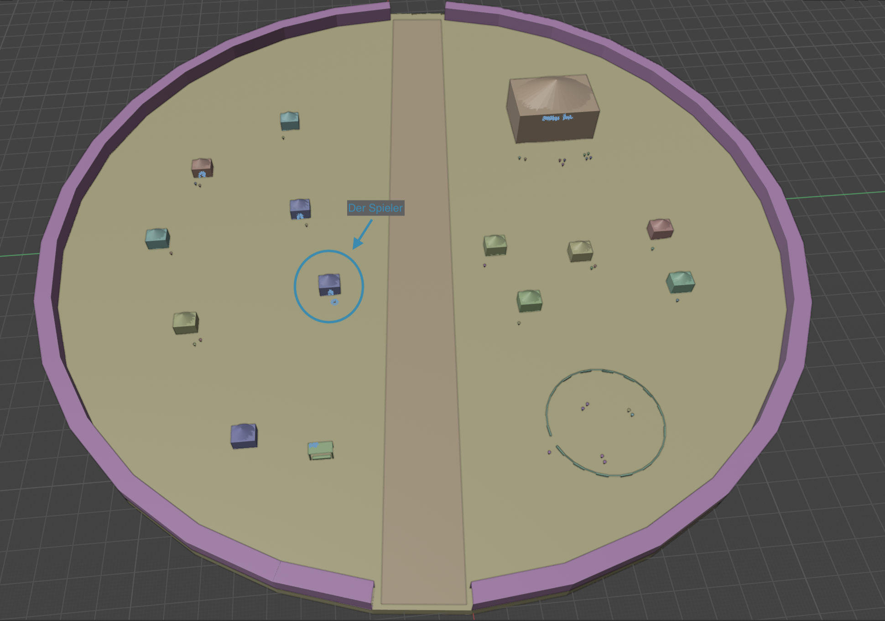

> Der Spieler steht vor seinem Haus

- Fokus:
  - Orientierung  
  - Sicht auf wichtige Gebäude  

---

### Schritt 5: Weg zum Ausrüstungsladen
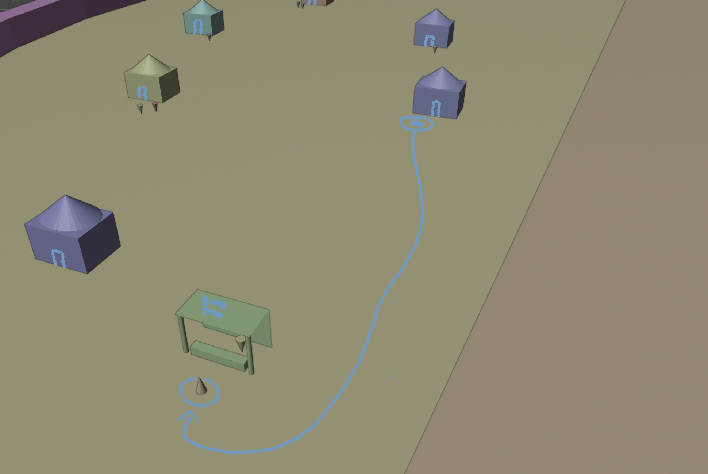

> Der Spieler läuft entlang der Straße zum Ausrüstungsladen.

---

### Schritt 6: Gespräch mit Bertram
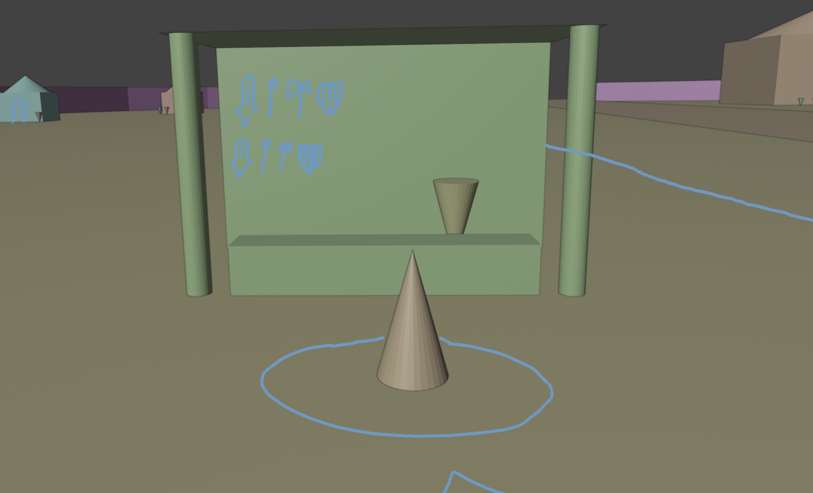

> Der Spieler spricht Bertram auf das beschädigte Schwert an.

**Dialog:**
```text
(Placeholder)
```

Ergebnis:
- Einführung von Bertrams Persönlichkeit  
- Aufsetzen der Quest

---

### Schritt 6.5: Quest erhalten


> Bertram bittet den Spieler, ein schweres Objekt zu Gregory zu bringen.

**Dialog:**
```text
(Placeholder)
```

Quest-Ziel:
- Übergabe an Gregory in der Kampfarena  

---

### Schritt 7: Weg zur Kampfarena
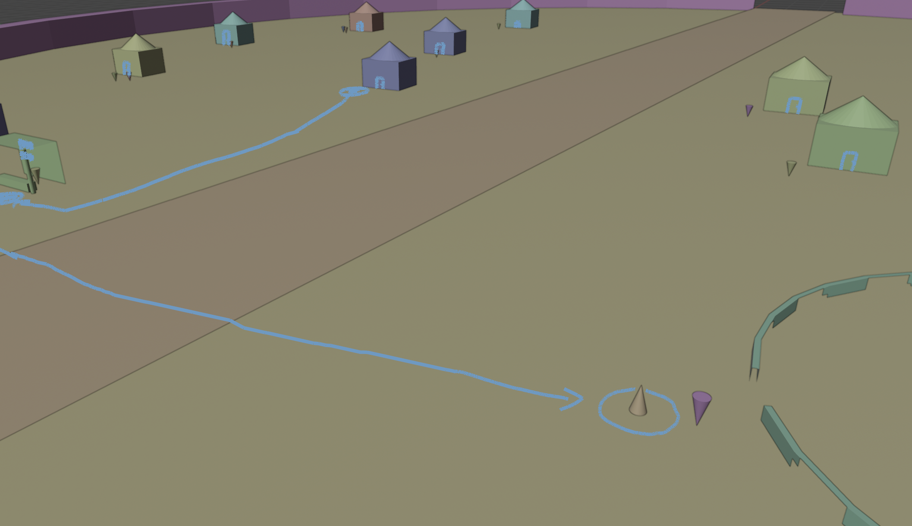

> Der Spieler bewegt sich zur Kampfarena.

---

### Schritt 8: Übergabe an Gregory
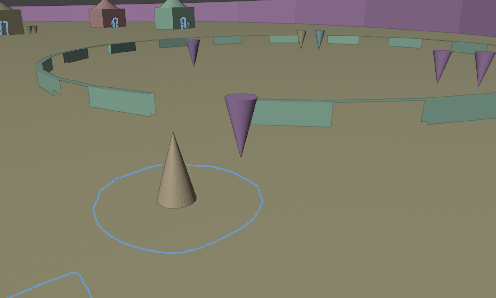

> Der Spieler übergibt das Objekt an Gregory.

**Dialog:**
```text
(Placeholder)
```

Ergebnis:
- Kurzer Dialog  
- Erhalt des Geldes  

---

### Schritt 9: Rückkehr zu Bertram
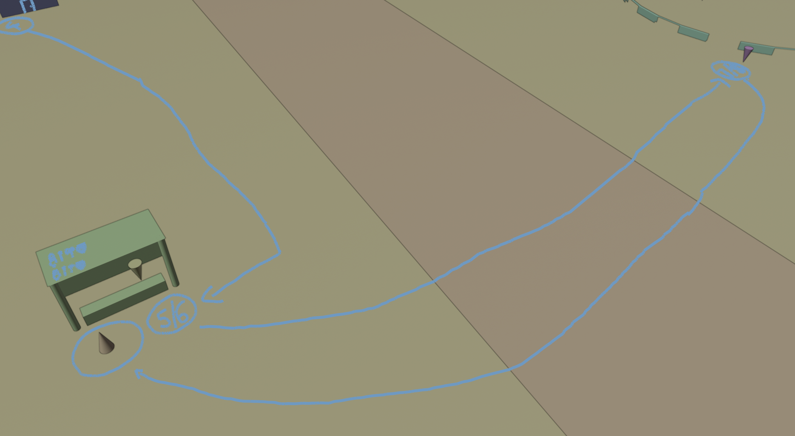

> Der Spieler kehrt mit dem Geld zum Ausrüstungsladen zurück.

**Dialog:**
```text
(Placeholder)
```

Fokus:
- Wiederholter Weg  
- Gefühl von Fortschritt  

---

### Schritt 10: Schwertreparatur starten


> Bertram beginnt mit der Reparatur des Schwertes.

**Dialog:**
```text
(Placeholder)
```

Hinweis:
- Quest-Abschluss  
- Schwert kann nach einem Tageszyklus abgeholt werden

---

## 8. Asset-Übersicht mit Referenzen & Beschreibung

### 8.1 Häuser


- **Stil:** Holz, einstöckig
- **Funktion:** Worldbuilding, NPC-Wohnorte

---

### 8.2 Ausrüstungsladen


- **Typ:** Offener Stand  
- **Sichtbare Assets:**
  - Waffen an Wänden
  - Amboss  
- **Gameplay:** Kaufen, Reparieren, Quests
- **NPCs**: Bertram

---

### 8.3 Kampfarena


- **Struktur:** Offener Platz mit Holzzaun  
- **Nutzung:**  
  - Training
  - Turniere
- **Gameplay:**
  - Trainieren für Stats verbessern
- **NPCs:** Gregory & Wachen

---

### 8.4 Gasthaus


- **Größe:** Größer als Wohnhäuser  
- **Etagen:** EG, 1G, 2G  
- **Gameplay:**
  - Schlafen
  - Dialoge 
  - Story-Events
- **NPCs:** Dorfbewohner, Fahrende Händler, Söldner

---

### 8.5 Straße


- **Material:** Erde
- **Funktion:**
  - Navigation
  - Händlerbewegung

---

### 8.6 Zaun & Tore


- **Material:** Holz
- **Gameplay:**
  - Tag-/Nacht-Zyklus
  - Tore nachts geschlossen

---

## 9. Asset-Priorisierung

| Priorität | Asset | Begründung |
|-----------|-------|------------|
| 1 | Haus | Startpunkt wenn man das Zimmer verlässt |
| 2 | Aurüstungsladen | Zweiter Ort in der Game-User-Story |
| 3 | Kampfarena | Dritter Ort der Game-User-Story |
| 4 | Straße | Atmosphäre/Worldbuilding |
| 5 | Zaun + Tore | Gibt dem Dorf nochmals eine "größere" Bedeutung |
| 6 | Gasthaus | Nice to have aber nicht wichtig für die Game-User-Story |