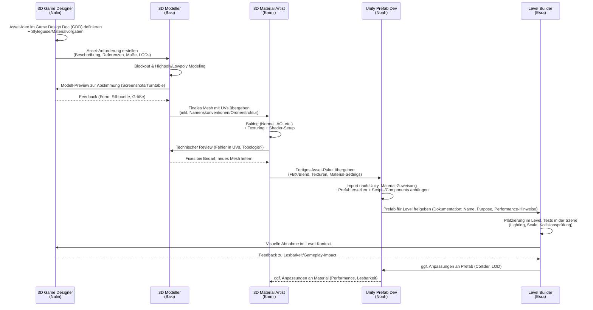
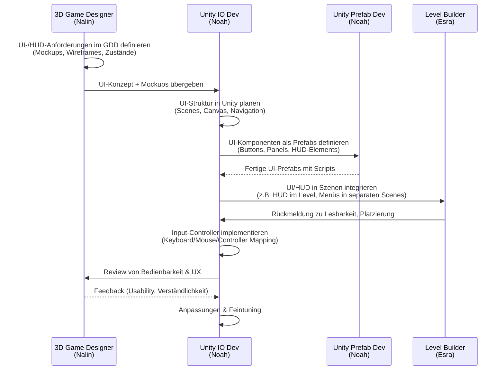

# Rollen & Prozesse im Projekt

Dieses Dokument beschreibt die Rollen im Team und die wichtigsten Workflows zwischen ihnen.

## Rollen & Teammitglieder

```mermaid
flowchart LR
    subgraph Teammitglieder
        N[Noah]
        Na[Nalin]
        B[Baki]
        E[Emmi]
        Es[Esra]
    end

    subgraph Rollen
        GD[3D Game Designer\n(Game Design Doc,\nLevel Blockout, Styleguide,\nMockups, Material-Defs)]
        Mod[3D Modeller\n(Hard Surface Modeling)]
        Mat[3D Material Artist\n(Shader & Textures)]
        LB[Level Builder\n(Scene-Orga, Terrain,\nLighting, Executables, VFX)]
        IO[Unity IO Dev\n(GUI Menu & HUD,\nInput-Controller)]
        Pref[Unity Prefab Dev\n(Instantiable Assets\nwith Code)]
    end

    %% Zuordnung bevorzugter Verantwortlichkeiten
    Na --> GD

    B --> Mod

    E --> Mat

    Es --> LB

    N --> IO
    N --> Pref
```

---

## 2. High-Level-Spiel-Workflow (von Idee zu Build)

Hier ein Gesamtprozess, wie ein Feature/Level/Asset durchs Team fließt.

````markdown
## High-Level-Prozess: Von Game Design zu spielbarem Build

```mermaid
flowchart LR
    GD[3D Game Designer\n(Nalin)] -->|GDD, Styleguide,\nLevelkonzept| Mod[3D Modeller\n(Baki)]
    Mod -->|3D-Modelle (ohne Materialien)| Mat[3D Material Artist\n(Emmi)]
    Mat -->|fertige Meshes mit Texturen,\nShader-Setups| Pref[Unity Prefab Dev\n(Noah)]
    Pref -->|Prefabs mit Logik,\nKomponenten| LB[Level Builder\n(Esra)]
    LB -->|Szenen, Lighting,\nVFX, Builds| IO[Unity IO Dev\n(Noah)]
    IO -->|Menüs, HUD,\nInput-Konnektivität| Build[Spielbare Builds\n(PC/Export)]

    %% Rückkopplungsschleifen
    Build -->|Feedback zu Spielgefühl,\nLesbarkeit, Performance| GD
```
````

**Interpretation (kurz):**

- **Game Designer (Nalin)**: definiert, _was_ gebaut wird (GDD, Styleguide, Level-Idee).
- **Modeller (Baki)**: erstellt die 3D-Geometrie.
- **Material Artist (Emmi)**: macht Texturen, Shader, Materials.
- **Prefab Dev (Noah)**: bringt Assets als wiederverwendbare Prefabs in Unity, inkl. Scripts.
- **Level Builder (Esra)**: baut Szenen, platziert Prefabs, kümmert sich um Lighting, Terrain, VFX, Exe-Builds.
- **IO Dev (Noah)**: verbindet das Ganze mit Menüs, HUD, Input und finalem Spielerlebnis.

---

## 3. Detaillierter Asset-Prozess (z.B. „Prop“)

Das passt sehr gut zu deinem Beispiel:

> Modeller entwirft 3D-Modell → Material Artist reviewt → Material Artist texturiert → usw.

````markdown
## Detailprozess: 3D-Asset-Pipeline (Prop)


````

---

## 4. Level-/Scene-Workflow

Hier eine Ansicht speziell für Level-Design und -Bau.

````markdown
## Detailprozess: Level-/Scene-Entwicklung

```mermaid
flowchart TB
    A[Game Design Doc<br/>(Levelziele, Core-Mechanics)]:::GD
    B[Level-Blockout<br/>(Whitebox)]:::GD
    C[Definition benötigter Assets<br/>(Props, Umgebung, Interactables)]:::GD
    D[3D Modeling & Materials<br/>(Modeller + Material Artist)]:::Art
    E[Prefab-Erstellung<br/>(Prefab Dev)]:::Code
    F[Level Assembly<br/>(Level Builder)]:::Level
    G[Gameplay-Tests<br/>(alle)]:::Test
    H[Balancing & Polishing<br/>(GD + LB + IO)]:::Level
    I[Build-Erstellung & Bereitstellung]:::Build

    A --> B --> C --> D --> E --> F --> G --> H --> I

    classDef GD fill:#fdd;
    classDef Art fill:#dfd;
    classDef Code fill:#ddf;
    classDef Level fill:#ffd;
    classDef Test fill:#eef;
    classDef Build fill:#fed;
```
````

---

## 5. UI / HUD / Input-Prozess (Unity IO Dev)

Damit der IO-Dev-Part sauber dokumentiert ist, noch ein Flow nur für Menüs/HUD:

````markdown
## Detailprozess: UI, HUD & Input


````
