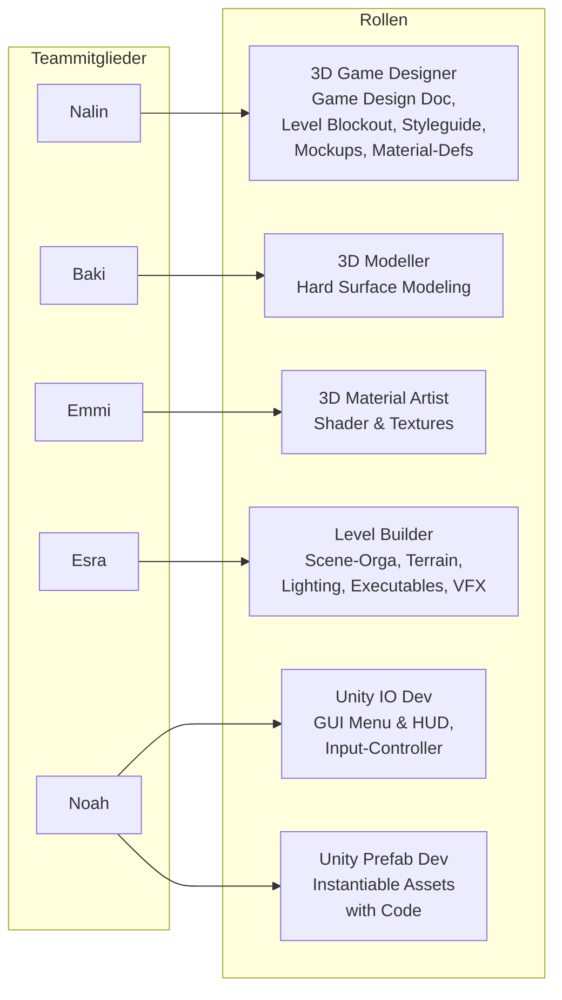
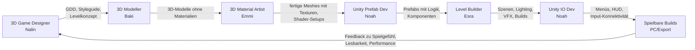

# Rollen & Prozesse im Projekt

Dieses Dokument beschreibt die Rollen im Team und die wichtigsten Workflows zwischen ihnen.

## Rollen & Teammitglieder

---

## 2. High-Level-Spiel-Workflow (von Idee zu Build)

Hier ein Gesamtprozess, wie ein Feature/Level/Asset durchs Team fließt.

## High-Level-Prozess: Von Game Design zu spielbarem Build

**Interpretation (kurz):**

- **Game Designer (Nalin)**: definiert, _was_ gebaut wird (GDD, Styleguide, Level-Idee).
- **Modeller (Baki)**: erstellt die 3D-Geometrie.
- **Material Artist (Emmi)**: macht Texturen, Shader, Materials.
- **Prefab Dev (Noah)**: bringt Assets als wiederverwendbare Prefabs in Unity, inkl. Scripts.
- **Level Builder (Esra)**: baut Szenen, platziert Prefabs, kümmert sich um Lighting, Terrain, VFX, Exe-Builds.
- **IO Dev (Noah)**: verbindet das Ganze mit Menüs, HUD, Input und finalem Spielerlebnis.

---

## 3. Detaillierter Asset-Prozess (z.B. „Prop“)

Das passt sehr gut zu deinem Beispiel:

> Modeller entwirft 3D-Modell → Material Artist reviewt → Material Artist texturiert → usw.

## Detailprozess: 3D-Asset-Pipeline (Prop)

---

## 4. UI / HUD / Input-Prozess (Unity IO Dev)

Damit der IO-Dev-Part sauber dokumentiert ist, noch ein Flow nur für Menüs/HUD:

## Detailprozess: UI, HUD & Input

